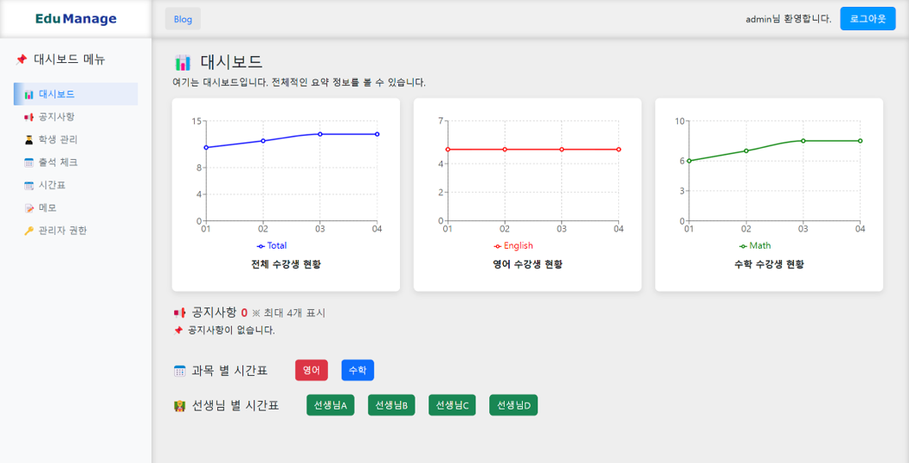

# edu-admin

A smart web-based student management system for academies, built with React and Firebase.



## 🔧 Technologies Used

- **React** (Create React App)
- **Firebase** (Firestore, Authentication)
- **Bootstrap** (UI components)
- **Chart.js / Recharts** (Visualization)

## 📋 Features

- 📅 Individual timetable management per student  
- 🧑‍🏫 Subject-teacher assignment by student  
- 🟢 Real-time attendance status (Present / Late / Absent)  
- 🔔 Announcement dashboard for admins  
- 📈 Student counts visualized by subject/time  
- 🔐 Role-based admin features  

## 🚀 Getting Started

### 1. Clone the repository

```bash
git clone https://github.com/sdasasqkim/edu-admin.git
cd edu-admin
```


### 2. Install dependencies
```bash
npm install
```

### 3. Set up Firebase config
프로젝트 루트에 .env 파일을 생성하고 다음과 같이 Firebase 설정을 추가하세요:
```bash
REACT_APP_API_KEY=your_api_key
REACT_APP_AUTH_DOMAIN=your_project.firebaseapp.com
REACT_APP_PROJECT_ID=your_project_id
REACT_APP_STORAGE_BUCKET=your_project.appspot.com
REACT_APP_MESSAGING_SENDER_ID=your_sender_id
REACT_APP_APP_ID=your_app_id
```
⚠️ .env는 .gitignore에 이미 포함되어 있어 Git에 업로드되지 않습니다.

### 4. Run the app
```bash
npm start
```
앱이 localhost에서 실행됩니다.

## 📦 Build for Production
```bash
npm run build
```

## 📚 Documentation
React Docs  
Firebase Docs  
React Router  
Bootstrap  
Recharts

## 👨‍💻 Author
GitHub: @sdasasqkim